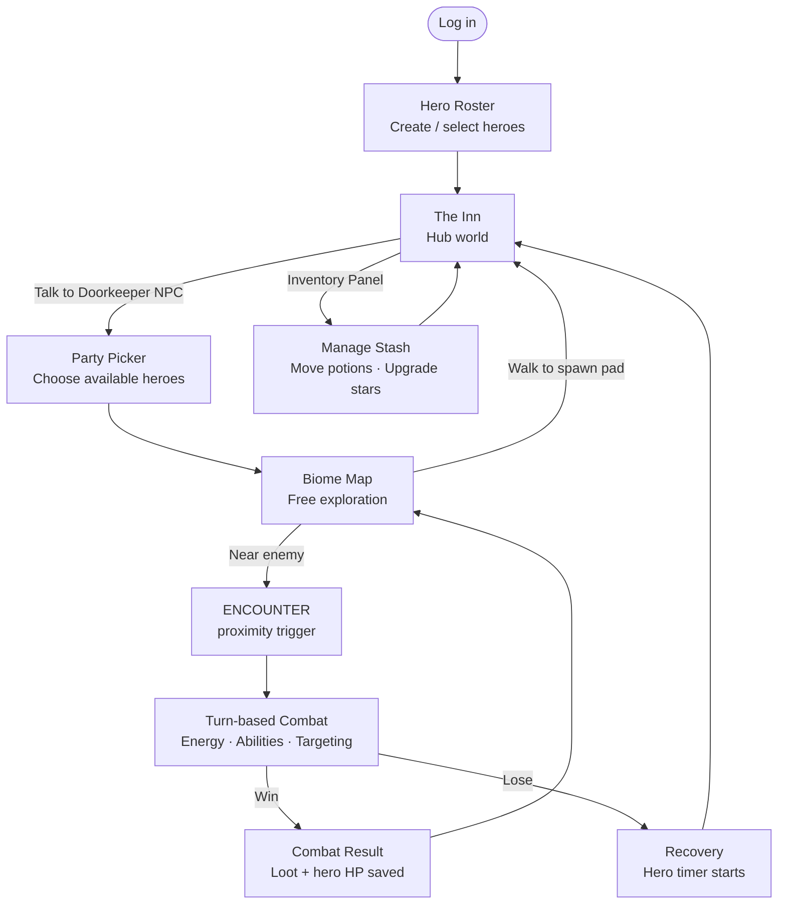
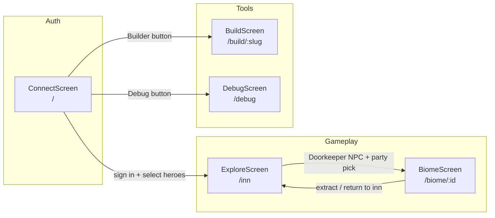
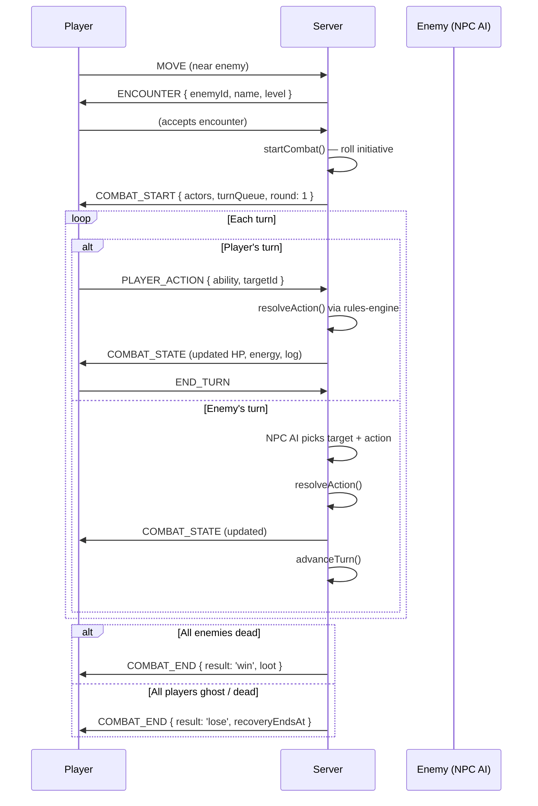

# Simple Quest Tactics — Game Design Document

> **Audience:** Developers and designers joining the project.  
> **Scope:** Current implemented features + forward design intent.  
> For deep technical architecture see [ARCHITECTURE.md](./ARCHITECTURE.md).  
> For full future design spec see [superpowers/specs/2026-04-20-game-design.md](./superpowers/specs/2026-04-20-game-design.md).

---

## What is this game?

Simple Quest Tactics is a **Diablo-style dungeon crawler** with **tactical turn-based combat**. Players build a persistent roster of heroes, dive into biome maps from a hub inn, fight encounters, collect loot, and return to upgrade and re-equip. There is no defined end state — the loop is exploration, growth, and discovery.

The game is built on three external modules:
- **Playsets** — renders the isometric board and handles token movement
- **SimpleQuest** — the RPG HUD (hero card, HP/energy, abilities, items)
- **ClickComics** — drives NPC dialogue and cutscene panels

The game app itself is purely the **coordinator** — it connects these modules together through a real-time server.

---

## Core game loop



---

## Screen flow



---

## Hero system

### Identity

Every hero has four identity fields, all chosen at creation and locked afterward:

| Field | Role | Source |
|-------|------|--------|
| **Name** | Player-authored | Free text |
| **Class** | Determines die size and ability set | `sq_classes` table |
| **Personality** | Shapes passive traits + dialog flavor | `sq_metadata` list |
| **Profession** | Flavor + future skill tree anchor | `sq_metadata` list |

Class determines the die type used in ability rolls — a Fighter rolls d8, a Mage rolls d6, etc. This is the core SimpleQuest mechanic.

### Stats (all sourced from `sq_classes` at creation)

| Stat | Default | Meaning |
|------|---------|---------|
| Max HP | 12 | Health pool |
| Max Energy | 5 | Ability fuel per turn |
| Speed | 3 | Move range in combat |
| Die | d6 | Base dice for ability rolls |

### Star rating

Heroes can be upgraded from 0 to 5 stars by spending **Star Fragments** at the Inventory Panel. Higher stars = more powerful heroes (exact bonus TBD in next milestone). Costs are defined in `STAR_UPGRADE_COSTS` in `shared-types`.

```
★ → ★★     20 fragments
★★ → ★★★   40 fragments
★★★ → ★★★★  80 fragments
★★★★ → ★★★★★ 150 fragments
```

### Gear slots

```
┌─────────────┬─────────────┐
│   Weapon    │  Off-hand   │
├─────────────┼─────────────┤
│    Armor    │   Trinket   │
└─────────────┴─────────────┘
```

Gear is equipped via `PATCH /heroes/:id/gear`. The equipped weapon's damage bonus is applied to all damage abilities during combat (`damageBonus` on `ActorState`, computed from `WEAPON_DAMAGE_BONUSES` in `shared-types`).

### Recovery

When a hero is killed in combat they enter a recovery state. `recovery_ends_at` is set on the hero record. Recovering heroes appear greyed-out on the roster and cannot be selected for a run. Current recovery time: **8 hours** (real-time).

---

## Locations

### The Inn (ExploreRoom)

The Inn is an explorable isometric map — not a UI screen. Players walk around and interact with NPCs by moving adjacent to them.

```
┌──────────────────────────────────┐
│                                  │
│   [Innkeeper]    [Sage]          │
│                                  │
│        SPAWN PAD                 │
│                                  │
│   [Blacksmith]  [Doorkeeper ──►Verdant Forest]
│                                  │
└──────────────────────────────────┘
```

**On entry:** Hero is auto-healed to full HP. This is the safe zone.

**NPC interactions** (proximity-triggered, using ClickComics dialogue panels):

| NPC | Dialog / Action |
|-----|----------------|
| Innkeeper | Welcome back message |
| Blacksmith | Placeholder (gear equip planned) |
| Doorkeeper | Opens party picker → transitions to biome |

### Verdant Forest (BiomeRoom)

A 100×100 open grid map. No walls — combat is positional but movement is unconstrained.

```
Spawn pad at (50, 50) — safe zone

  Near (0–15 tiles): Wolves lvl 1, light drops
  Mid  (16–30 tiles): Bandits lvl 2, medium drops
  Far  (31+ tiles):   Forest Spirits lvl 3, heavy drops
```

Spawn points are hardcoded for the MVP (5 enemy spawn locations with defined drop table slugs). Procedural generation is a future milestone.

---

## Combat system

Combat is **in-place** — there is no room or screen transition. When a player walks near an enemy, the board switches to combat mode and the same Playsets board becomes the combat board.

### Combat flow



### Turn structure

Each actor gets one turn per round. Turn order is set at combat start (initiative roll: if players beat the enemy level on a d20, players go first).

On a player's turn they can:
1. **Move** — spend energy to move (1 energy per tile)
2. **Use an ability** — spend energy per `energyCost` on the ability card
3. **Use a potion** — send `USE_POTION` (BiomeRoom only; costs 1 energy)
4. **End turn** — pass

On an enemy's turn, the NPC AI selects the nearest hero and uses `ENEMY_SLASH` (1d4 damage, costs 3 energy).

### Damage formula

```
damage = roll(ability.diceNotation) + actor.damageBonus
```

`damageBonus` is populated from the hero's equipped weapon via `WEAPON_DAMAGE_BONUSES`. Currently: `debug-sword` adds +1.

### Combat end states

| Result | What happens |
|--------|-------------|
| `win` | Loot rolled per enemy via drop tables, awarded to all participants; hero HP saved to DB |
| `lose` | All heroes set `recovery_ends_at`; hero enters 8-hour recovery |
| `cancelled` | Combat interrupted (e.g. room disconnect); combat state cleared, no penalty |

---

## Inventory system

### Resources

| Resource | Icon | Source | Use |
|----------|------|--------|-----|
| Gold | 🪙 | Enemy drops | Future: shop purchases, upgrades |
| Health Potions | 🧪 | Enemy drops, stash | Heal hero during combat (BiomeRoom) |
| Star Fragments | ✨ | Enemy drops | Upgrade hero star rating |
| Decor Shards | 💎 | Enemy drops | Purchase builder props |
| Builder Props | 🏗️ | Enemy drops (rare) | Use in BuildScreen scenes |

### Stash vs hero inventory

```
Player Stash (per account)
├── Gold
├── Health Potions     ← can move to/from hero inventory
├── Star Fragments
├── Decor Shards
└── Builder Props (map of propId → count)

Hero Inventory (per hero)
└── Health Potions     ← consumed during BiomeRoom combat
```

Moving potions between stash and hero is done via the **Inventory Panel** (right sidebar tab in ExploreScreen and BiomeScreen) using `POST /inventory/move-potion`.

### Drop tables

Each enemy type has a named drop table in the `drop_tables` Supabase table. Each entry has a weight, min/max quantity, and item type. After combat, the server rolls drops per enemy and awards the total loot to all participants.

```
Current enemy → drop table slugs:
  Wolf          → 'wolf'
  Bandit        → 'bandit'
  Forest Spirit → 'forest-spirit'
```

Drop table rows must exist in Supabase. Currently managed in the dashboard (not in a migration seed script yet).

---

## Builder

The BuildScreen (`/build/:slug`) gives designers a Playsets-powered tool to author named scenes (stored in the `scenes` table). Scenes are loaded into ExploreRoom via the `SCENE_STATE` message. Currently used to build the Inn layout.

Decor Shards and Builder Props are the in-game economy for the future **player-created shop** system — players will collect these on runs and use them to build publishable shops that appear in other players' biome maps. See the full spec for round 1 UGC design.

---

## Debug tools

The `/debug` screen (linked from the roster) provides dev utilities without needing backend scripts:

| Tool | API call |
|------|----------|
| Add gold / potions / star fragments / decor shards | `POST /debug/give-items` |
| Equip debug sword (+1 dmg) on a hero | `POST /debug/equip-weapon` |
| Unequip weapon | `POST /debug/unequip-weapon` |

The debug sword is defined in `WEAPON_DAMAGE_BONUSES` in `shared-types`. Adding new weapons means adding them there and ensuring the server includes `weaponBonus` in `HERO_STATE` sends.

---

## SimpleQuest HUD integration

The HUD is the `<simple-quest>` web component, wrapped by `simplequest-hud` package.

```
                  characterJson() signal
                        │
                        ▼
             ┌─────────────────────┐
             │   <simple-quest>    │
             │                     │
             │  Name · Class · ★★  │
             │  ⚔ debug-sword (+1) │
             │  ████████░░ HP      │
             │  ⚡⚡⚡⚡⚡ Energy   │
             │  [Slash] [Fireball] │
             │  [🧪 Potion ×3]     │
             └─────────────────────┘
                        │
           abilityactivate / itemactivate events
                        │
                        ▼
             Screen handler → room.send()
```

The HUD is **read-only during play** (`locked="true"`) — it displays server state but cannot be edited. The character creation flow (`ConnectScreen → create` view) uses the HUD in edit mode to build a new hero.

The `characterJson` signal on each screen merges `heroState` (from server `HERO_STATE`) with live combat data (from `combatState`) so the HUD always reflects the most current values.

---

## Forward design priorities

These are defined in the spec doc but not yet implemented:

1. **Procedural biome generation** — currently Verdant Forest uses hardcoded spawn points
2. **XP and level-up** — `awardXp` exists in hero-service but is never called
3. **Hero scrolls** — new hero unlock mechanic (drops from bosses/treasure)
4. **Upgrade trees** — Roster, Dungeon, and Combat trees (Sage NPC)
5. **Guild system** — co-op runs, shared upgrade progress
6. **Player-created shops** — UGC loop with Decor Shards and Builder Props
7. **Additional biomes** — Dungeon Depths, Ruined Castle
8. **Minimap** — revealed-tiles system for biome exploration
